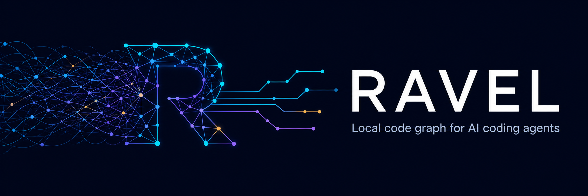

<p align="center">
  
</p>

<p align="center">
  <a href="https://github.com/guigaoliveira/ravel/actions/workflows/ci.yml"></a>
  <a href="https://www.npmjs.com/package/@guigaoliveira/ravel-cli"></a>
  <a href="https://github.com/guigaoliveira/ravel/releases"></a>
  <a href="LICENSE"></a>
</p>

<p align="center">
  <strong>Understand symbols, callers, dependencies, and change impact from a local index.</strong>
</p>

Ravel is a local code graph for TypeScript and JavaScript. It helps coding
agents navigate projects without repeatedly crawling files with grep, glob, and
full-file reads.

No API key or hosted service is required. Ravel reads project files and writes
only its `.ravel/` index and agent configuration when explicitly requested.

## Install

The npm package downloads the matching native binary automatically:

```bash
npm install -g @guigaoliveira/ravel-cli
ravel --version
```

Other options:

```bash
# macOS / Linux
curl -fsSL https://raw.githubusercontent.com/guigaoliveira/ravel/main/scripts/install.sh | sh

# Windows PowerShell
irm https://raw.githubusercontent.com/guigaoliveira/ravel/main/scripts/install.ps1 | iex

# From source
cargo install --path crates/ravel-cli --locked
```

See [installation and agent setup](docs/install.md) for platform details and
troubleshooting.

## Start

From the project you want to index:

```bash
ravel init
ravel status
ravel context PaymentService
```

`ravel init` creates the local configuration and initial index. To connect
supported coding agents, run this once and restart an agent that was already
running:

```bash
ravel install --yes
```

## Daily use

```bash
ravel context SYMBOL
ravel search QUERY --kind prefix
ravel query SYMBOL --reverse
ravel impact SYMBOL --risk
ravel sync
```

Queries use compact JSON by default. Add `--pretty` for human-readable output.
Use `--root /absolute/path/to/project` when running Ravel outside the project
directory.

The default index covers `.ts`, `.tsx`, `.mts`, `.cts`, `.js`, `.jsx`, `.mjs`,
and `.cjs` files. Common dependency/build directories are skipped and Git
repositories also honor `.gitignore`.

## Agent setup

`ravel install --yes` detects supported agent configurations and adds Ravel to
them without touching source files. It supports global or project-local setup;
manual configuration and uninstall instructions are in
[docs/install.md](docs/install.md).

## Documentation

- [Installation and agent setup](docs/install.md)
- [Configuration and sync behavior](docs/config.md)
- [Performance notes](docs/performance.md)
- [Contributing](CONTRIBUTING.md)
- [Changelog](CHANGELOG.md)

## License

Licensed under the [Apache License 2.0](LICENSE).
